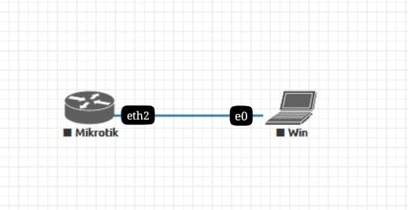
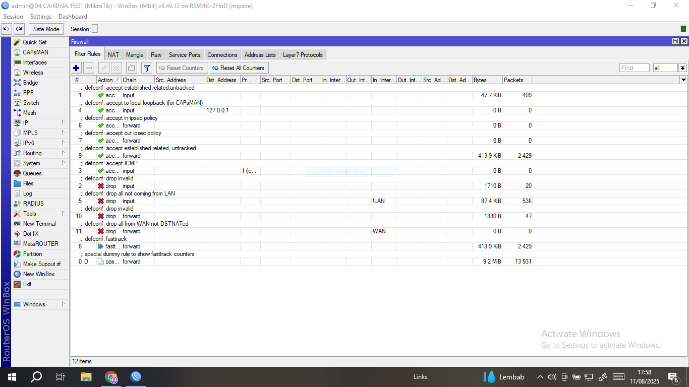
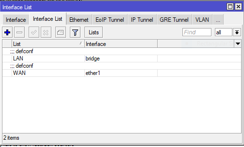
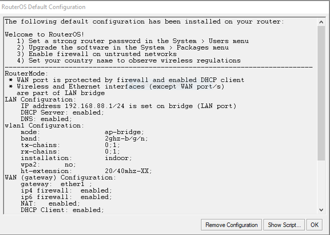

# LAB-2
# Default configuration mikrotik
    Assalamu’alaikum Warrohmatullohi Wabarokatuh

    Di sini saya akan menjelasan apa saja yang di konfigurasikan secara default dari mikrotik via winbox.   
   Di sini saya mamakai topologi yang menggunakan eth2.  

    Kenapa saya memilih eth2, karena Saat pertamakali menjalankan Mikrotik dengan default configuration   
    kita tidak bisa mengakses dengan port ether1, karna firewall memblokir akses selain LAN,   
    sedangkan port ether1 adalah WAN. Bisa dilihat di Firewalls > Filter Rules  

    Dan untuk melihat interface WAN (Wide Area Network) lihat di Interfaces > Interfaces List    

    jika kalian baru pertama kali login, maka akan muncul tampilan seperti ini:

    Klik OK  

    Selanjutnya, 
    

    
