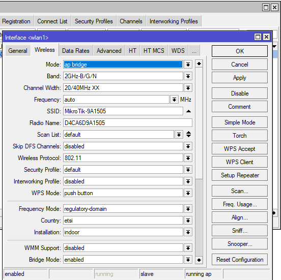
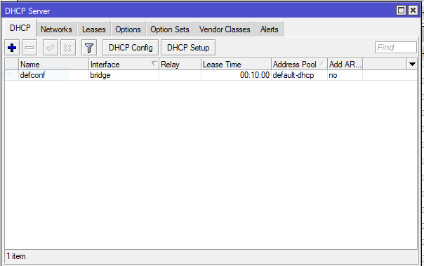

# LAB-2
12 agustus 2025
# Default configuration mikrotik
    Assalamu’alaikum Warrohmatullohi Wabarokatuh

    Di sini saya akan menjelasan apa saja yang di konfigurasikan secara default dari mikrotik via winbox.   
   Di sini saya mamakai topologi yang menggunakan eth2.  

    Kenapa saya memilih eth2, karena Saat pertamakali menjalankan Mikrotik dengan default configuration   
    kita tidak bisa mengakses dengan port ether1, karna firewall memblokir akses selain LAN,   
    sedangkan port ether1 adalah WAN. Bisa dilihat di Firewalls > Filter Rules  

    Dan untuk melihat interface WAN (Wide Area Network) lihat di Interfaces > Interfaces List    

    Jika kalian baru pertama kali login, maka akan muncul tampilan seperti ini :  
    

    Di dalam gambar tersebut berisi apa saja konfigurasi default mikrotik.  
    Klik OK  

    1. WLAN Configuration
    

    Seperti yang terlihat di gambar ada beberapa seting default seperti,   
    wlan1 dikonfigurasi dalam mode ap-bridge pada band frekuensi 2.4 GHz.   
    ht-extension diatur 20/40 MHz XX   
    untuk menyesuaikan antara kestabilan dan kecepatan.  

    2. LAN Configuration 
    
    Pada LAN, alamat IP default adalah 192.168.88.1/24. DHCP Server aktif,   
    sehingga setiap perangkat yang terhubung ke Mikrotik akan memperoleh IP address secara otomatis.
    

    3. WAN Configuration

    Gateway diarahkan ke port ether1. Firewall IPv4 aktif,  
    NAT berfungsi membagi alamat IP publik dari ISP ke seluruh perangkat LAN,  
    dan DNS mengonversi nama domain menjadi alamat IP. Dengan konfigurasi ini,  
    router dapat langsung digunakan hanya dengan menghubungkan kabel internet ke ether1.  

# Kesimpulan 
        
    Konfigurasi default Mikrotik memudahkan pengguna baru untuk memulai konfigurasi awal,   
    namun penting untuk segera mengubah pengaturan default tersebut demi keamanan dan kinerja jaringan yang optimal. 

    
